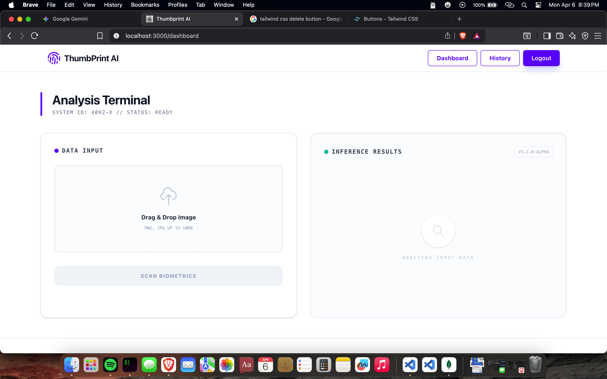
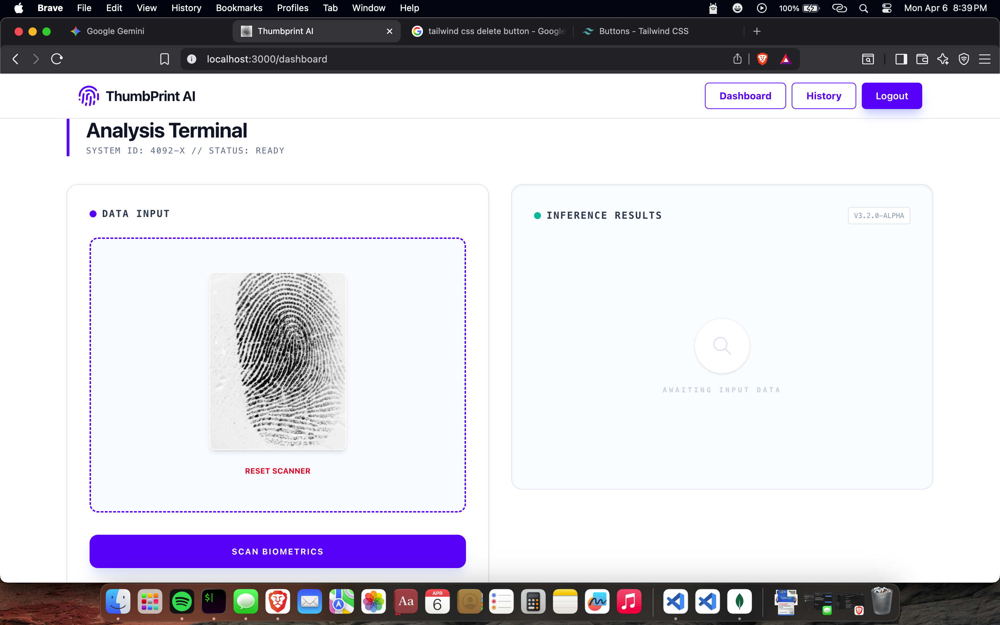
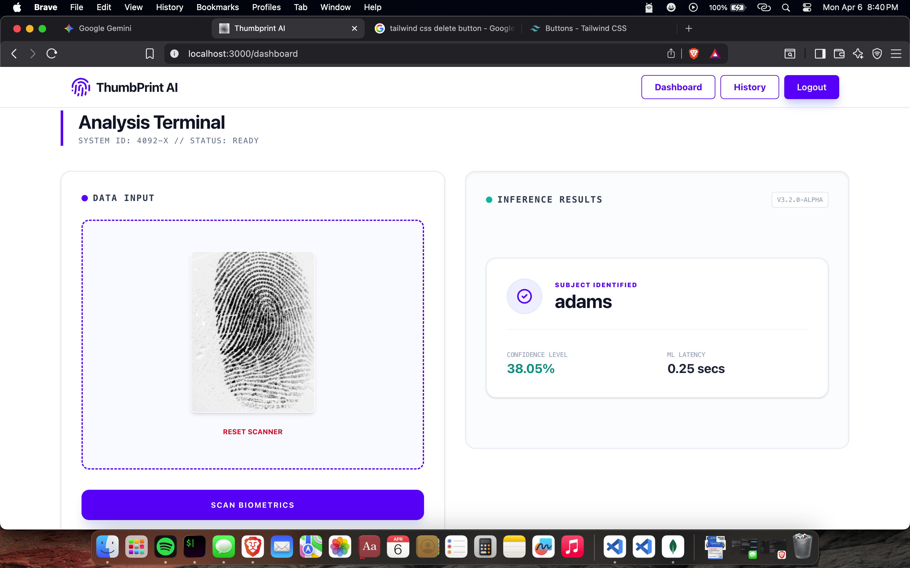
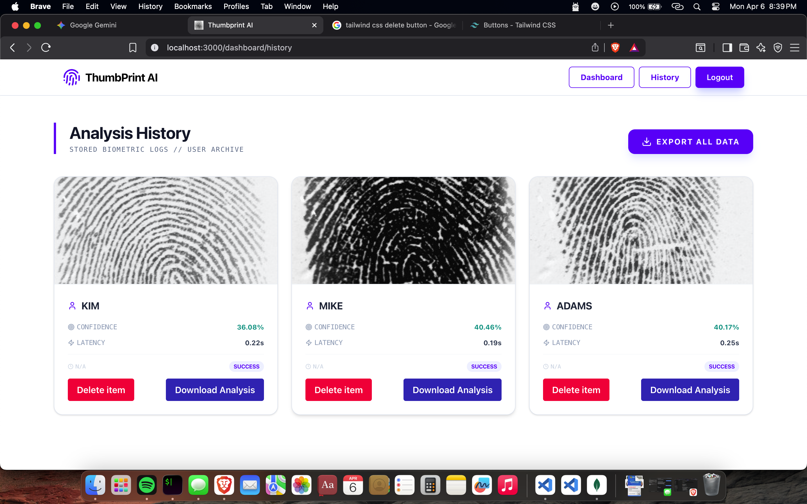

# Thumb Print Analysis (ThumbPrint AI)

[](https://www.python.org/)
[](https://flask.palletsprojects.com/)
[](https://www.tensorflow.org/)
[](https://nextjs.org/)
[](https://react.dev/)
[](https://tailwindcss.com/)
[](https://creativecommons.org/licenses/by-nc/4.0/)
[](https://github.com/mbonuchinedum/thumbPrintAnalysis/graphs/commit-activity)

**Thumb Print Analysis** is a cutting-edge full-stack biometric identification system. It utilizes Deep Learning (TensorFlow) to analyze thumbprint ridge patterns and minutiae, providing real-time identification through a sleek Next.js dashboard.

---

## 🖼️ Project Previews

<div align="center">
  
  
  <br />
  
  
</div>

---

## 🚀 Key Features

- **Biometric Identification**: High-accuracy thumbprint matching using Convolutional Neural Networks (CNN).
- **Secure Authentication**: JWT-based session management with Bcrypt password hashing.
- **Real-time Analysis**: Instant feedback with confidence scores and processing latency.
- **History Tracking**: Comprehensive logs of all previous analyses stored in MongoDB.
- **Responsive Dashboard**: Modern UI built with Next.js 16, Framer Motion, and Tailwind CSS.
- **Detailed Logging**: Dual-stream logging (Console + File) for robust backend monitoring.

---

## 🏗️ Project Structure & Architecture

The project is split into two main repositories within this directory:

### 📂 Backend (Python/Flask)
Located in `/backend`, it serves as the AI engine and API provider.
- `app.py`: Entry point for the Flask server (Port 3001).
- `routes/`: Modularized API endpoints (Login, Register, Dashboard).
- `machineLearning/`: The inference engine that loads `.joblib` model bundles.
- `database/`: MongoDB connection and schema logic.
- `logFormatter/`: Custom UI for terminal logs.
- `thumbPrintImages/`: Storage for uploaded biometric data.

### 📂 Frontend (Next.js/React)
Located in `/frontend`, it provides the user interface.
- `src/app/`: Next.js App Router structure (Auth, Dashboard, Public routes).
- `src/components/`: Reusable UI elements (Navbar, Footer, AlertBox).
- `src/middleware.jsx`: Client-side route protection and JWT verification.
- `tailwind.config.mjs`: Styling configuration for Tailwind CSS 4.0.

---

## 🛠️ Detailed Installation & Setup Guide

### Prerequisites
- **Node.js**: v18.0.0 or higher
- **Python**: v3.10 or higher
- **MongoDB**: Local instance or MongoDB Atlas URI
- **Git**: For version control

---

### 1. 🐍 Backend Setup (Flask)

1. **Navigate to the directory**:
   ```bash
   cd backend
   ```

2. **Create a Virtual Environment**:
   ```bash
   python3 -m venv venv
   source venv/bin/activate  # Windows: venv\Scripts\activate
   ```

3. **Install Core Modules**:
   The backend relies on several heavy-duty libraries:
   ```bash
   pip install tensorflow flask flask-cors bcrypt python-dotenv opencv-python scikit-learn flask-socketio imutils pymongo PyJWT
   ```
   *Alternatively, use:* `pip install -r requirements.txt`

4. **Environment Configuration**:
   Create a `.env` file in the `backend/` root:
   ```env
   SECRET_KEY=your_secret_key_here
   MONGODB_URI=mongodb://localhost:27017/
   MONGODB_DB_NAME=thumbPrintAnalysis
   ```

5. **Machine Learning Model**:
    Copy your machine learning model from the ```notebooks``` directory in the root folder to the backend ```machineLearning/models``` folder. 
    ```bash
        cp notebooks/model.joblib backend/machineLearning/models/model.joblib 
    ```
    Or you can manually copy it using your GUI interface. For this program to work, your machine learning model must be in the ```machineLearning/models``` directory, and the name must be ```model.joblib```

6. **Run the Server**:
   ```bash
   python3 app.py
   ```
   The server will start on `http://0.0.0.0:3001` with debug mode enabled.

---

### ⚛️ 2. Frontend Setup (Next.js)

1. **Navigate to the directory**:
   ```bash
   cd ../frontend
   ```

2. **Install Dependencies**:
   ```bash
   npm install
   ```

3. **Memory Allocation (Optional)**:
   Due to the complexity of some components, you may need to increase Node's memory limit (already pre-configured in `package.json`):
   ```bash
   export NODE_OPTIONS='--max-old-space-size=8192'
   ```

4. **Environment Configuration**:
   Create a `.env.local` file:
   ```env
   NEXT_PUBLIC_SERVER_URL=http://localhost:3001
   ```

5. **Start Development Server**:
   ```bash
   npm run dev
   ```
   Open `http://localhost:3000` to view the application.

---

## 🤖 Machine Learning Implementation

The system uses a **Joblib-wrapped TensorFlow model**. 
- **Training**: Models are developed in `notebooks/Finger Print Analysis.ipynb`.
- **Deployment**: The trained `model.joblib` must be placed in `backend/machineLearning/models/`.
- **Inference**: The `MachineLearning` class handles image preprocessing (resizing to grayscale), tensor conversion, and softmax prediction.

---

## ⚖️ License & Attribution

### Author: **Engr. Mbonu Chinedum**
- **Location**: Nigeria
- **Status**: Open Source for Educational Use

This project is licensed under the **Creative Commons Attribution-NonCommercial 4.0 (CC BY-NC 4.0)**.
- **You are free to**: Share and Adapt.
- **Under these terms**: You must give credit, and you may **NOT** use it for commercial purposes.
